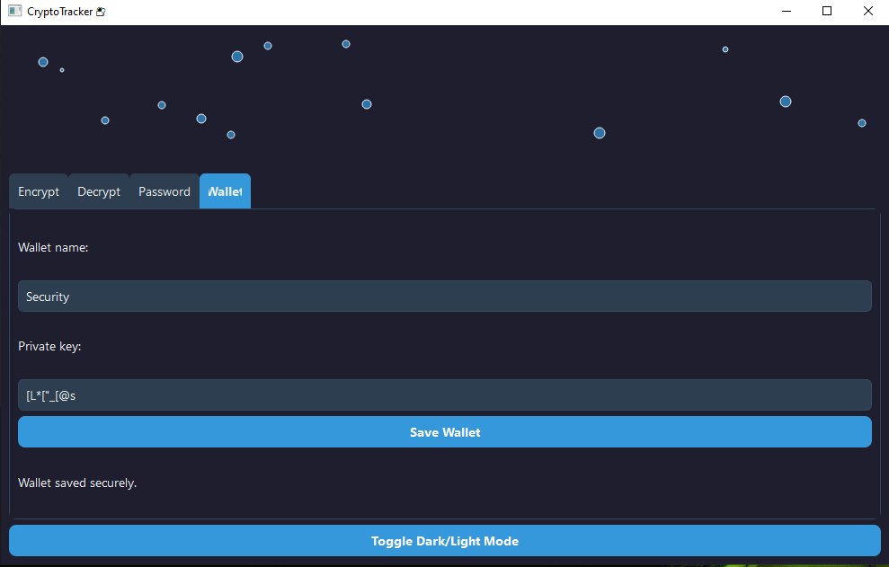

# CryptoTracker 🔐

CryptoTracker is a modular, GUI-based Python application for secure encryption, password generation, and wallet management. Built with PyQt5 and Cryptography, it offers a sleek dark/light themed interface, particles animation, and tabbed navigation — designed for developers, crypto users, and security-conscious professionals.

---

## ✨ Features

- **AES-based encryption/decryption** of sensitive text
- **Secure password generator** with customizable length
- **Encrypted wallet storage** for private keys
- **Dark/Light mode toggle** for visual comfort
- **Particles background** for modern UI aesthetics
- **Modular architecture** for easy extension and testing

---

## 🧱 Project Structure

```bash
CryptoTracker/
├── main.py                  # Launches the GUI
├── requirements.txt         # Python dependencies
├── core/                    # Backend logic
│   ├── crypto_engine.py     # AES encryption/decryption
│   ├── password_manager.py  # Password generation
│   └── wallet_store.py      # Wallet encryption & storage
├── ui/                      # PyQt5 GUI components
│   ├── main_window.py       # Main window with tabs
│   ├── encrypt_tab.py       # Encrypt interface
│   ├── decrypt_tab.py       # Decrypt interface
│   ├── password_tab.py      # Password generator interface
│   ├── wallet_tab.py        # Wallet manager interface
│   ├── particles_widget.py  # Animated background
│   └── theme_manager.py     # Dark/Light theme switcher
├── style/
│   └── style.qss            # Branded stylesheet with hover effects
├── config/
│   └── settings.py          # UI colors, fonts, and security constants
├── data/
│   └── wallets.txt          # Encrypted wallet data (auto-created)
├── tests/
│   └── test_*.py            # Unit tests for each module
└── screenshot/
    └── result.png           # UI preview
```

🖼️ Screenshot




⚙️ Installation
```bash
git clone https://github.com/yourusername/CryptoTracker.git
cd CryptoTracker
pip install -r requirements.txt
python main.py
```

##🧪 Usage Guide

*🔐 Encrypt Text

1 .Go to Encrypt tab

2. Enter your message

3. Click Encrypt → Encrypted result appears below

*🔓 Decrypt Text

1. Go to Decrypt tab

2. Paste encrypted string

3. Click Decrypt → Original message appears

*🔑 Generate Password

1. Go to Password tab

2. Select desired length

3. Click Generate Password → Secure password appears

*💼 Save Wallet

1. Go to Wallet tab

2. Enter wallet name and private key

3. Click Save Wallet → Data stored encrypted in data/wallets.txt

*🌗 Toggle Theme

1. Click Toggle Dark/Light Mode at bottom → Switch UI theme instantly

*🧪 Run Tests

```bash
python -m unittest discover tests
```
📄 License
This project is licensed under the MIT License — see LICENSE for details.
